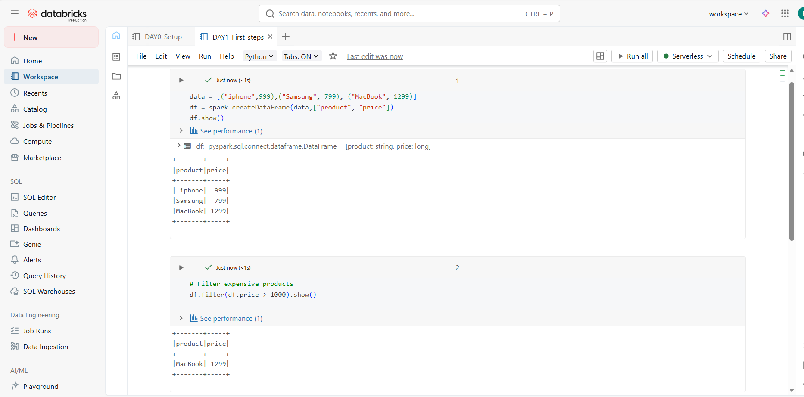

# PHASE 1: FOUNDATION (Days 1-4)

---

## DAY 1 (09/01/26)– Platform Setup & First Steps

### Learn:

- Why Databricks vs Pandas/Hadoop?
- Lakehouse architecture basics
- Databricks workspace structure
- Industry use cases (Netflix, Shell, Comcast)

### 🛠️ Tasks:

1. Create Databricks Community Edition account
2. Navigate Workspace, Compute, Data Explorer
3. Create first notebook
4. Run basic PySpark commands

