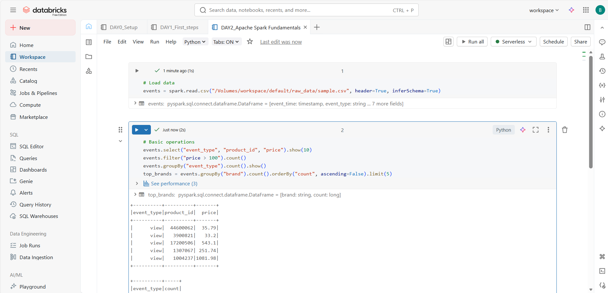

# PHASE 1: FOUNDATION (Days 1-4)

## DAY 2 (10/01/26) – Apache Spark Fundamentals

### Learn:

- Spark architecture (driver, executors, DAG)
- DataFrames vs RDDs
- Lazy evaluation
- Notebook magic commands (`%sql`, `%python`, `%fs`)

### 🛠️ Tasks:

1. Upload sample e-commerce CSV
2. Read data into DataFrame
3. Perform basic operations: select, filter, groupBy, orderBy
4. Export results

