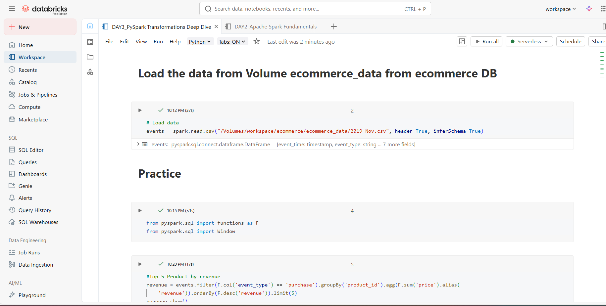
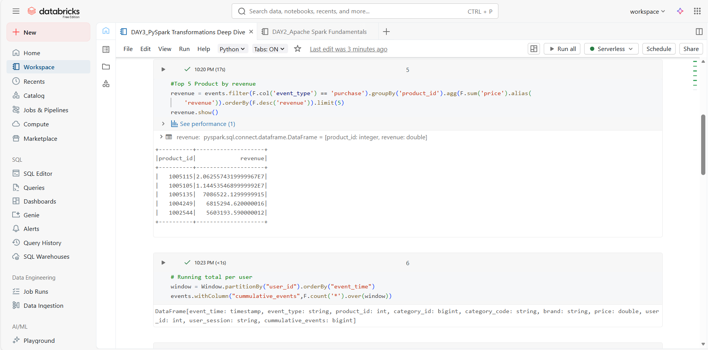
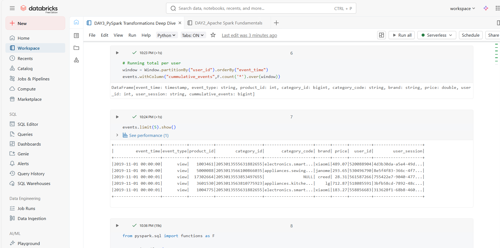
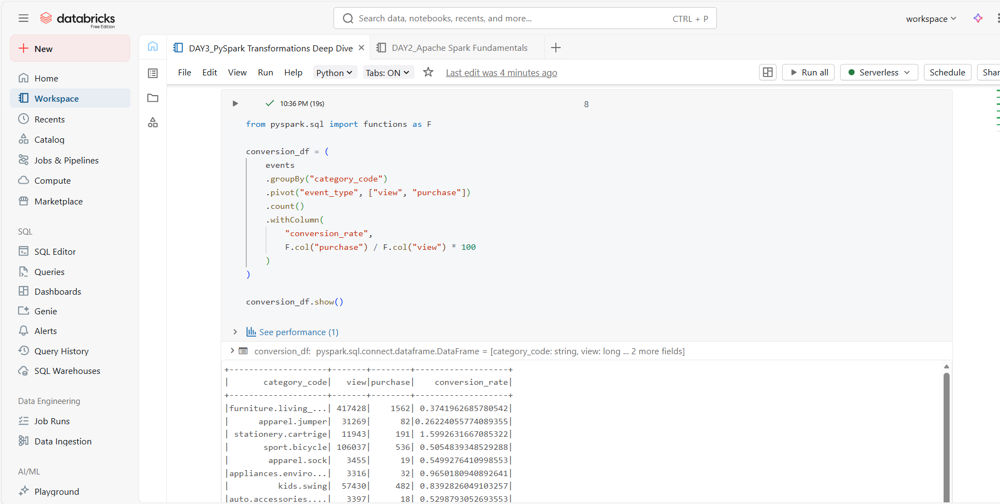

# PHASE 1: FOUNDATION (Days 1-4)

## DAY 3 (11/01/26) – PySpark Transformations Deep Dive

### Learn:

- PySpark vs Pandas comparison
- Joins (inner, left, right, outer)
- Window functions (running totals, rankings)
- User-Defined Functions (UDFs)

### 🛠️ Tasks:

1. Load full e-commerce dataset
2. Perform complex joins
3. Calculate running totals with window functions
4. Create derived features

### 📝 Practice:

```python
from pyspark.sql import functions as F
from pyspark.sql.window import Window

# Top 5 products by revenue
revenue = events.filter(F.col("event_type") == "purchase") \
    .groupBy("product_id", "product_name") \
    .agg(F.sum("price").alias("revenue")) \
    .orderBy(F.desc("revenue")).limit(5)

# Running total per user
window = Window.partitionBy("user_id").orderBy("event_time")
events.withColumn("cumulative_events", F.count("*").over(window))

# Conversion rate by category
events.groupBy("category_code", "event_type").count() \
    .pivot("event_type").sum("count") \
    .withColumn("conversion_rate", F.col("purchase")/F.col("view")*100)
```

### 🔗 Resources:

- [Window Functions](https://spark.apache.org/docs/latest/api/python/reference/pyspark.sql/window.html)
- [PySpark Functions API](https://spark.apache.org/docs/latest/api/python/reference/pyspark.sql/functions.html)







