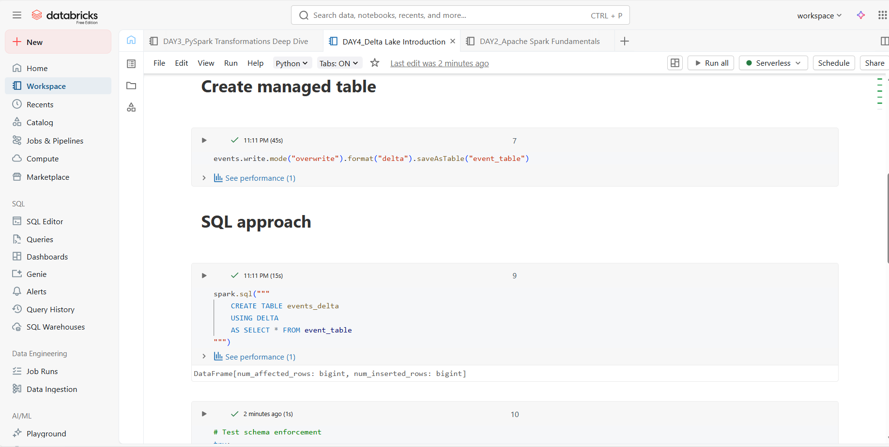
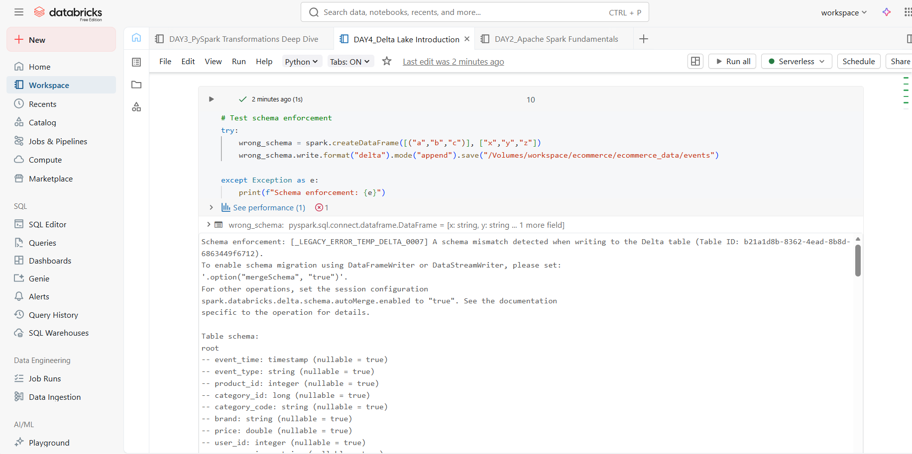

### **DAY 4 (12/01/26)– Delta Lake Introduction**

### Learn:

- What is Delta Lake?
- ACID transactions
- Schema enforcement
- Delta vs Parquet

### 🛠️ Tasks:

1. Convert CSV to Delta format
2. Create Delta tables (SQL and PySpark)
3. Test schema enforcement
4. Handle duplicate inserts

### 📝 Practice:

```python
# Convert to Delta
events.write.format("delta").mode("overwrite").save("/delta/events")

# Create managed table
events.write.format("delta").saveAsTable("events_table")

# SQL approach
spark.sql("""
    CREATE TABLE events_delta
    USING DELTA
    AS SELECT * FROM events_table
""")

# Test schema enforcement
try:
    wrong_schema = spark.createDataFrame([("a","b","c")], ["x","y","z"])
    wrong_schema.write.format("delta").mode("append").save("/delta/events")
except Exception as e:
    print(f"Schema enforcement: {e}")

```

### 🔗 Resources:

- [Delta Lake Docs](https://docs.databricks.com/delta/)
- [Delta Tutorial](https://docs.databricks.com/delta/tutorial.html)




